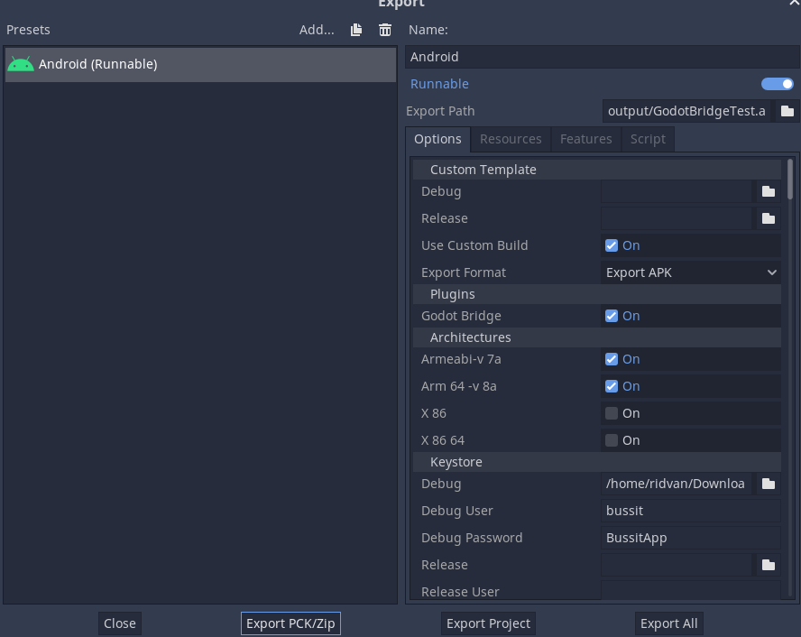
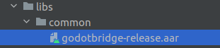

# GodotBridge
Event Bus From Godot To Android And Back

This is an Android share plugin for [Godot Game Engine](https://godotengine.org/) 3.2.2 or higher. 
With that you'll be send and receive event to Android App.

## How To Use
- Configure, install  and enable the "Android Custom Template" for your project, just follow the [official documentation](https://docs.godotengine.org/en/latest/getting_started/workflow/export/android_custom_build.html);
- go to the [releases tab](https://github.com/ridvandongelci/GodotBridge/releases), choose a version and download the respective _GodotBridge_0.1.zip_ package;
- extract the zip content (_godotbridge-release.aar_ and _GodotBridge.gdap_ files) inside the ```res://android/plugins``` directory on your Godot project;
- on the Project -> Export -> Options, turn on the "Use Custom Build" and "Godot Bridge" on the "Plugins" field;



## Integration
To have android studio support
- create a folder `android/build/libs/common` and copy _godotbridge-release.aar_



- add following snippet to `dependencies`:
```
    implementation 'org.greenrobot:eventbus:3.2.0'
    implementation fileTree(dir: 'libs/common', include: ['*.jar', '*.aar'])
```
- Register and unregister the event bus using the following snippet:
```
	@Override
	protected void onPause() {
		super.onPause();
		EventBus.getDefault().unregister(this);
	}

	@Override
	protected void onResume() {
		super.onResume();
		EventBus.getDefault().register(this);
	}
```
- To receive messages on Android App subscribe to `AppMessage`:
```
	@Subscribe
	public void onAppMessage(AppMessage appMessage) {
    // TODO: get message and process
		// Log.d("APP", appMessage.getMessage());
	}
```
- To send messages to Godot use the `GodotMessage`:
```
EventBus.getDefault().post(new GodotMessage(some string));
```

- On Godot side access to singleton:
```
  var _godot_bridge = null
	if(Engine.has_singleton("GodotBridge")):
		_godot_bridge = Engine.get_singleton("GodotBridge")
```
- To receive message on Godot side connect to `on_godot_message` signal:
```
	_godot_bridge.connect("on_godot_message", self, "on_godot_message")
  func on_godot_message(input):
	  print("GODOT %s" % input)
```
- To send message from Godot side use `sendAppMessage` method:
```
_godot_bridge.sendAppMessage("some data")
```
